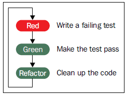
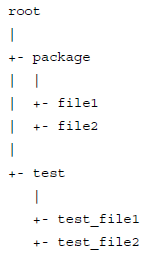
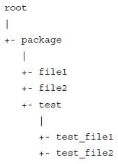

# Test-Driven Python Development

## 1. Getting Started with Test-Driven Development
## 2. Red-Green-Refactor - The TDD Cycle
## 3. Code Smells and Refactoring
## 4. Using Mock Objects to Test Interactions
## 5. Working with Legacy Code
## 6. Maintaining Your Test Suite
## 7. Executable Documentation with doctest
## 8. Extending unittest with nose2
## 9. Unit Testing Patterns
## 10. Tools to Improve Test-Driven Development

---
---

# 1. Getting Started with Test-Driven Development

## Understanding test-driven development

The flowchart below shows the three steps in the process of TDD.



Let's walk through the preceding flowchart in a little more detail.

* Red: The first step is to write a small unit test case. As we have only written the test and haven't written the implementation yet, this test will naturally fail.
* Green: Next, we write the code that implements the desired functionality. At this point, we aren't looking to create the best design or the most readable code. We just want something simple that will pass the test.
* Refactor: Now that the test is passing, we go back and look at the code to see whether it can be improved. This may involve improving the design, or making it more readable or maintainable. We can use the tests written so far to ensure that we aren't breaking anything during the refactoring step.
* The cycle repeats as we proceed to the next test and implement the next bit of functionality.

Developers who are familiar with TDD usually go through this cycle many times an hour, implementing small steps of functionality each time.

## TDD versus unit testing versus integration testing

Before we go further, let's take a short detour to define some terms and understand the differences between them. It is very easy to get confused between these terms, and they are often used with different meanings in different places.

In the broadest sense of the term, unit testing simply means testing a single unit of code, isolated from other code that it might be integrated with. Traditionally, unit testing was an activity that was primarily performed by test engineers. These engineers would take code given by the developers and run them through a suite of tests to verify that the code worked. Since this code was tested before integration, the process fits into the definition of a unit test. Traditional unit testing was typically a manual affair, with test engineers walking through the tests cases by hand, although some teams would go a step further and automate the tests.

An integration test is a test that involves exercising more than one unit of the system. The goal is to check whether these units have been integrated correctly. A typical integration test might be to go to a web page, fill in a form, and check whether the right message is displayed on the screen. In order for this test to pass, the UI must show the form correctly, the input must be captured correctly, and that input must be passed on to any logic processing. The steps might involve reading and writing from a database before a message is generated and the UI has to display it correctly. Only if all these interactions succeed will the integration test pass. If any one step should fail, the integration test will fail.

At this point, a valid question would be to ask why we need unit testing at all. Why not write only integration tests, where a single test could check so many parts of the application at once? The reason is that integration tests do not pinpoint the location of failure. A failing integration test could have an error in the UI, or in the logic, or somewhere in the way data is read or written. It will take a lot of investigation to see where the error is and fix it. By contrast, with well-written unit tests, a failing unit test will pinpoint exactly what is failing. Developers can go right to the point and fix the error.

Along the way, teams started moving to a process where developers themselves wrote tests for the code that they had implemented. These tests would be written after the developer had finished the implementation, and helped verify that the code worked as expected. These tests were usually automated. Such a process is generally called developer testing or developer unit testing.

TDD takes developer tests one step further, by writing the test before starting the implementation.

* **Developer tests:** Any kind of automated unit tests written by the developer, either before or after functionality is implemented.
* **Unit testing:** Any kind of testing of a particular unit of an application, either by a developer or a tester. These tests might be automated, or run manually.
* **Integration testing:** Any kind of testing that involves two or more units working together. These tests are typically performed by a tester, but they could be done by a developer as well. These tests might be manual or automated.

As we can see, unit testing is a general term, whereas developer testing is a specific subset of unit testing, and TDD is a specific form of developer testing.

On the surface, traditional unit testing, developer testing and TDD look similar. They all appear to be about writing tests for a single unit of code, with only minor variations based on who writes the test and whether the tests are written before the code or after.

However, dig deeper and differences appear. First, the intent is vastly different. Traditional unit testing and developer testing are all about writing tests to verify that the code works as it is supposed to. On the other hand, the main focus of TDD is not really about testing. The simple act of writing a test before the implementation changes the way we think when we implement the corresponding functionality. The resulting code is more testable, usually has a simple and elegant design, and is more maintainable and readable. This is because making a class easy to test also encourages good design practices, such as decoupling dependencies and writing small, modular classes.

Thus, one can say that TDD is all about writing better code, and it is just a happy side effect that we end up with a fully automated test suite as an outcome.

This difference in intent manifests itself in the type of tests. Developer testing usually results in large test cases, with a hefty part of the test code involved in test setup. By contrast, tests written using TDD are very small and numerous. Some people like to call them micro tests to differentiate them from other developer tests or traditional unit tests. TDD-style unit tests also try to be very fast to run because they are executed every few minutes during the development process.

Finally, the tests that are written in TDD are those that drive the development forward, and not necessarily those that cover all imaginable scenarios. For example, a function that is supposed to process a file might have tests to handle cases when the file exists or it doesn't exist, but probably won't have tests to see what happens if the file is 1 terabyte in size. The latter is something that a tester might conceivably test for, but would be an unusual test in TDD unless the function is clearly expected to work with such a file.

This really highlights the difference between TDD and other forms of unit testing.

> TDD is about writing better, cleaner, more maintainable code, and only incidentally about testing.

## Unit Test Example

```Python3
import unittest

class StockTest(unittest.TestCase):
    def test_price_of_a_new_stock_class_should_be_None(self):
        stock = Stock("GOOG")
        self.assertIsNone(stock.price)


if __name__ == '__main__':
    unittest.main()
```

What does this code do?

1. First, we import unittest. This is the library that has the test framework that we are going to use. Luckily for us, it is bundled into the Python standard library by default and is always available, so we don't need to install anything, we can just import the module directly.

2. Second, we create a class StockTest. This class will hold all the test cases for the Stock class. This is just a convenient way of grouping related tests together. There is no rule that every class should have a corresponding test class. Sometimes, if we have a lot of tests for a class, then we may want to create separate test classes for each individual behavior, or group the tests some other way. However, in most cases, creating one test class for an actual class is the best way to go about it.

3. Our StockTest class inherits from the TestCase class in the unittest module. All tests need to inherit from this class in order to be identified as a test class.

4. Inside the class, we have one method. This method is a test case. The unittest framework will pick up any method that starts with test. The method has a name that describes what the test is checking for. This is just so that when we come back after a few months, we still remember what the test does.

5. The test creates a Stock object and then checks if the price is None. assertIsNone is a method provided by the TestCase class that we are inheriting from. It checks that its parameter is None. If the parameter is not None, it raises an AssertionError and fails the test. Otherwise, execution continues to the next line. Since that is the last line of the method, the test completes and is marked as a pass.

6. The last segment checks if the module was executed directly from the command line. In such a case, the __name__ variable will have the value __main__, and the code will execute the unittest.main() function. This function will scan the current file for all tests and execute them. The reason we need to wrap this function call inside the conditional is because this part does not get executed if the module is imported into another file.

## Test errors versus test failures

There are two reasons why a test might not pass: It might have failed or it might have caused an error. There is a small difference between these two. A failure indicates that we expected some outcome (usually via an assert), but got something else. For example, in our test, we are asserting that stock.price is None. Suppose stock.price has some other value apart from None, then the test will fail.

An error indicates that something unexpected happened, usually an unexpected exception was raised. In our previous example, we got an error because the Stock class has not yet been defined.

In both the cases, the test does not pass, but for different reasons, and these are reported separately as test failures and test errors.

## Reorganizing the test code

We've added the test cases in the same file as the code. This is a good, simple way to add test cases to standalone scripts and applications that are not too complex. However, for larger applications, it is a good idea to keep test code separate from production code.

There are two common patterns for organizing test code this way.

The first pattern is to keep test code in a separate root directory, as shown in the following:



The other pattern is to keep test code as a submodule of the main code, as shown in the following:



The first pattern is commonly used for standalone modules as it allows us to distribute the code and tests together. Tests can generally be run without having to perform a lot of setup or configuration. The second pattern has an advantage when the application has to be packaged without the test code, for example when deploying to production servers, or distributing to customers (in the case of a commercial application). However, both the patterns are in popular use, and it is mainly a personal preference as to which method to use.

## Running the tests

The command that you use in order to write the tests is:

``` python.exe -m unittest ```

This command will go through the current directory and all subdirectories and run all the tests that are found. This is the default autodiscover mode of execution, where the command searches all the files and runs the tests. Autodiscovery can also be explicitly run with the following command:

```python3 -m unittest discover```

Autodiscover can be customized to check in specific directories or files with the following parameters:

* -s start_directory: Specify the start directory from where the discovery should start. This defaults to the current directory.

* -t top_directory: Specify the top-level directory. This is the directory from which imports are performed. This is important if the start directory is inside the package and you get errors due to incorrect imports. This defaults to the start directory.

* -p file_pattern: The file pattern that identifies test files. By default it checks for python files that start with test. If we name our test files something else (for example, stock_test.py), then we have to pass in this parameter so that the file is correctly identified as a test file.

To illustrate the difference between the start and top directory, run the following command from the src directory:

```python3 -m unittest discover -s stock_alerter```

The preceding command will fail with an import error. The reason is because when the start directory is set to stock_alerter, then the tests directory is imported as a top-level module, and the relative import fails. To get around this, we need to use the following command:

```python3 -m unittest discover -s stock_alerter -t```

This command will import all modules relative to the top directory, and so stock_ alerter correctly becomes the main module.

You can also disable autodiscovery and specify only certain tests to be run:

* Passing in a module name will only run the tests within that module. For example, python3 -m unittest stock_alerter.tests.test_stock will run the tests only in test_stock.py.

* You can further refine to a specific class or method, such as python3 -m unittest stock_alerter.tests.test_stock.StockTest.

# 2. Red-Green-Refactor - The TDD Cycle

## Tests are executable requirements

An observant reader might have caught on to the terminology used in the previous sentence, where I said that we can think about the requirement to implement next, instead of saying that we can think about the test to write next. Both statements are equivalent, because in TDD, tests are nothing but requirements. Each time we write a test and implement code to make it pass, what we actually do is make the code meet some requirement. Looking at it another way, tests are just executable requirement specifications. Requirement documentation often goes out of sync with what is actually implemented, but this is impossible with tests, because the moment they go out of sync, the test will fail.

## Arrange-Act-Assert

Let us start with the first requirement. Here is the test:

```Python3
def test_stock_update(self):
    """
    An update should set the price of the stock object
    We will be using the `datetime` module for the timestamp
    """
    goog = Stock("GOOG")
    goog.update(datetime(2014, 2, 12), price=10)
    self.assertEqual(10, goog.price)
```

Here we call the update method (which doesn't exist yet) with the timestamp and price and then check that the price has been set correctly. We use the assertEqual method provided in the unittest.TestCase class to assert the value.

Since we are using the datetime module to set the timestamp, we will have to add the line from datetime import datetime to the top of the file before it will run.

This test follows the pattern of Arrange-Act-Assert.

1. Arrange: Set up the context for the test. In this case, we create a Stock object. In other tests, it may involve creating multiple objects or hooking a few things together that will be required by the particular test.

2. Act: Perform the action that we want to test. Here, we call the update method with the appropriate arguments.

3. Assert: Finally we assert that the outcome was as expected.

In this test, each part of the pattern took one line of code, but this is not always the case. Often there will be more than one line for each part of the test.

## Testing for exceptions

Since checking for exceptions is quite a common case, unittest provides a simpler way to do it:

```Python3
def test_negative_price_should_throw_ValueError(self):
    goog = Stock("GOOG")
    self.assertRaises(ValueError, goog.update, datetime(2014, 2, 13), -1)
```

The assertRaises method takes the expected exception as the first argument, the function to call as the second argument, and the parameters to the function are passed as in the remaining arguments. If you need to call the function with keyword arguments, then they can be passed in as keyword arguments to the assertRaises method.

## Exploring assert methods

Let us take the remaining requirement. Here is the test:

```Python3
def test_stock_price_should_give_the_latest_price(self):
    goog = Stock("GOOG")
    goog.update(datetime(2014, 2, 12), price=10)
    goog.update(datetime(2014, 2, 13), price=8.4)
    self.assertAlmostEqual(8.4, goog.price, delta=0.0001)
```

What this test does is to simply call update twice, and when we ask for the price, provide us with the newer one. The interesting point about the test is that we use the assertAlmostEqual method here. This method is often used when checking equality with floating point numbers. Why don't we use plain old assertEqual?

The reason is that due to the way floating points are stored, the result may not be exactly the number you expect. There could be a very small difference between what you expect and the actual number that is stored. Taking this into account, the assertAlmostEqual method allows us to specify a tolerance in the comparison. So, for example, if we expect 8.4 but the actual value is 8.39999999, the test will still pass.

The assertAlmostEqual method has two ways of specifying tolerance. The method we used above involves passing in a delta parameter which says that the difference between the expected value and the actual value should be within the delta. We've specified the delta parameter above as 0.0001, which means any value between 8.3999 and 8.4001 will pass the test. The other way of specifying tolerance is to use the places parameter as shown in the following code:

self.assertAlmostEqual(8.4, goog.price, places=4)

If this parameter is used, then both the expected and the actual values are rounded to the given number of decimal places before being compared. Note that you need to pass either the delta parameter or the places parameter. It is an error to pass both parameters together.

So far, we've used the following assertion methods:

* assertIsNone
* assertEqual
* assertRaises
* assertAlmostEqual
* fail

The unittest module provides a large number of assertion methods that we can use for various conditions. Some of the common ones are listed below:

* assertFalse(x, msg), assertTrue(x, msg)
* assertIsNone(x, msg), assertIsNotNone(x, msg)
* assertEqual(x, y, msg), assertNotEqual(x, y, msg)
* assertAlmostEqual(x, y, places, msg, delta),
* assertNotAlmostEqual(x, y, places, msg, delta)
* assertGreater(x, y, msg), assertGreaterEqual(x, y, msg)
* assertLess(x, y, msg), assertLessEqual(x, y, msg)
* assertIs(x, y, msg), assertIsNot(x, y, msg)
* assertIn(x, seq, msg), assertNotIn(x, seq, msg)
* assertIsInstance(x, cls, msg), assertNotIsInstance(x, cls, msg)
* assertRegex(text, regex, msg), assertNotRegex(text, regex, msg)
* assertRaises(exception, callable, *args, **kwargs)
* fail(msg)

Most of the preceding functions are self explanatory. The following are some points that require a bit of explanation:

* msg parameter: Most of the assert methods take an optional message parameter. A string can be passed here and it will be printed out in case the assertion fails. Usually, the default message is quite descriptive and this parameter is not required. Most of the time it is used with the fail method, as we saw a little while ago.

* assertEqual versus assertIs: These two sets of assertions are very similar. The critical difference is that the former checks for equality while the latter assertion is used to check for object identity. The second assertion fails in previous example because although both objects are equal, they are still two different objects, and hence their identity is different:

```python
>>> test = unittest.TestCase()
>>> test.assertEqual([1, 2], [1, 2]) # Assertion Passes
>>> test.assertIs([1, 2], [1, 2]) # Assertion Fails
Traceback (most recent call last):
File "<stdin>", line 1, in <module>
File "C:\Python34\lib\unittest\case.py", line 1067, in assertIs
self.fail(self._formatMessage(msg, standardMsg))
```

* assertIn/assertNotIn: These asserts are used to check if an element is present in a sequence. This includes strings, lists, sets, and any other object that supports the in operator.

* assertIsInstance/assertNotIsInstance: They check if an object is an instance of the given class. The cls parameter can also be a tuple of classes, to assert that the object is an instance of any one of them.

The unittest module also provides some less-frequently-used assertions:

* assertRaisesRegex(exception, regex, callable, *args, **kwargs): This assertion is similar to assertRaises, except that it takes an additional regex parameter. A regular expression can be passed in here and the assertion will check that the right exception was raised, as well as that the exception message matches the regular expression.

* assertWarns(warning, callable, *args, **kwargs): It is similar to assertRaises, but checks that a warning was raised instead.

* assertWarnsRegex(warning, callable, *args, **kwargs): It is the warning equivalent of assertRaisesRegex.

## Specific asserts versus generic asserts

One question that might come to your mind is why there are so many different assert methods. Why can't we just use assertTrue instead of the more specific assert, as shown in the following code:

```Python3
assertInSeq(x, seq)
assertTrue(x in seq)

assertEqual(10, x)
assertTrue(x == 10)
```

While they are certainly equivalent, one motivation for using a specific assert is that you get a better error message if the assertion fails. When comparing objects like lists and dicts, the error message will show exactly where the difference occurs, making it much easier to understand. Therefore, it is recommended to use the more specific asserts wherever possible.

## Setup and teardown

If you notice, each test does the same setup by instantiating a Stock object that is then used in the test. In this case, the setup is just one line, but sometimes we might have to do multiple steps before we are ready to run the test. Instead of repeating this setup code in each and every test, we can make use of the setUp method provided by the TestCase class:

```Python3
def setUp(self):
    self.goog = Stock("GOOG")
```

## Brittle tests

A test is brittle when a change in the implementation details requires a change in the test cases. Ideally, a test should be testing the interface and not the implementation directly. After all, it is the interface that other units will be using to interact with this unit. When we test through the interface, it allows us the freedom to change the implementation of code without worrying about breaking the tests.

There are three ways a test might fail:

* If there is a bug introduced in the code being tested

* If the test is tightly coupled to an implementation and we make changes to the code that modify the implementation, but without introducing a bug (for example, renaming a variable or modifying the internal design)

* If the test requires some resource that is unavailable (for example, connecting to an external server, but the server is down)

Ideally, the first case should be the only case where a test should fail. We should try to avoid the second and third as much as possible.

Sometimes it might be important to test specific implementation details. For example, suppose we have a class that is expected to perform a complex calculation and cache it for future use. The only way to test the caching functionality would be to verify if the calculated value is stored in the cache. If we later change the caching method (for example, moving from a file cache to memcache), then we will have to change the test as well.

Brittle tests can be worse than no tests, as the maintenance overhead of having to fix ten or twenty tests with every change in the implementation can turn developers away from TDD, increase the amount of frustration, and lead to teams disabling or skipping testing. Here are some guidelines on how to think about test brittleness:

* If at all possible, avoid using implementation details in tests, and only use the publicly exposed interface. This includes using only the interface methods in setup code and assertions.

* If the test needs to check functionality that is internal to the unit being tested, and it is an important functionality, then it might make sense to check for specific implementation actions.

* If it is cumbersome to use the external interface to set up the exact state that we want, or there is no interface method that retrieves the specific value we want to assert, then we may need to peek into the implementation in our tests.

* If we are fairly confident that the implementation details are very unlikely to change in the future, then we might go ahead and use implementation-specific details in the test.

For the second and third cases, the important point is to understand that there is a tradeoff between convenience, test readability, and brittleness. There is no right answer and it is a subjective decision that needs to be taken, weighing up the pros and cons of each specific situation.
